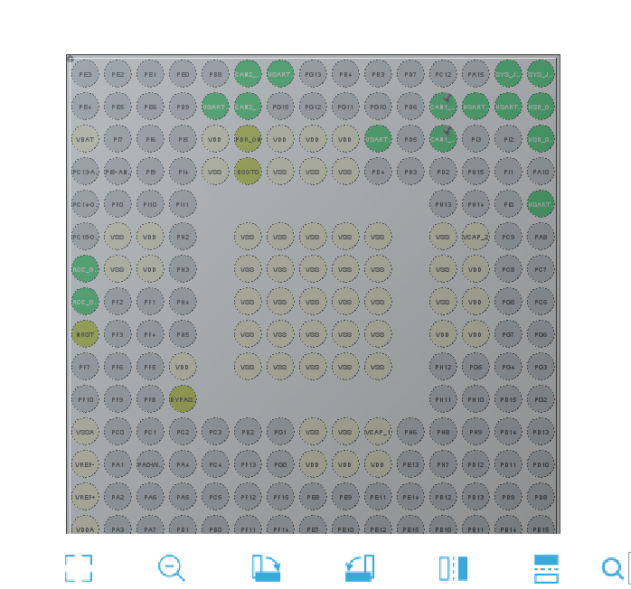

当前阶段的
目标：联调实现上下位机通讯
记录日期：11.7

1. 

链接：

---
决定：
1. E.g.
UART1引脚线序：

| 1 | 2 | 3 | 4 |
|---|---|---|---|
|RDX|TXD|GND|5V|

2. 
配置clock configuration
12， 144
波特率 9600
code generation: 勾选第一个generate peripheral initialization
Project Manager中 第一個Linker settings設置0 $\times$ 1000
Misc controls：--cpp11 后會出現error. 需添加显示类型转换

3. E.g.
device id:
正面下口-004
正面上口-001
背面右-014
背面左-016

（简洁记录当前阶段的核心决定或方案、配置，不用过多解释，比如 哪个引脚用于什么硬件、开发了什么功能函数）

---
研发过程：
1. E.g.
// 修改后的代码 (使用 C 风格强制转换) USBD_EpDescTypeDef *pEpCmdDesc = (USBD_EpDescTypeDef *)USBD_GetEpDesc(USBD_CDC_CfgDesc, DC_CMD_EP); USBD_EpDescTypeDef *pEpOutDesc = (USBD_EpDescTypeDef *)USBD_GetEpDesc(USBD_CDC_CfgDesc, DC_OUT_EP);

2. E.g.
hal_status = HAL_PCD_DeInit((PCD_HandleTypeDef *)pdev->pData);

3. E.g.
12.14：    

（这是你开发过程中的详细日志和记录，用于回溯你开发过程中）

---
理论知识：

（收录 你学习的理论知识，不需要一定和项目相关）

---
链接：
（记录 你使用到的文件夹、网页链接，以 方便开发过程当中的再次访问）

---
反思：
（谱写跟整个项目无关的玩意，比如你灵机一动的想法、灵感）